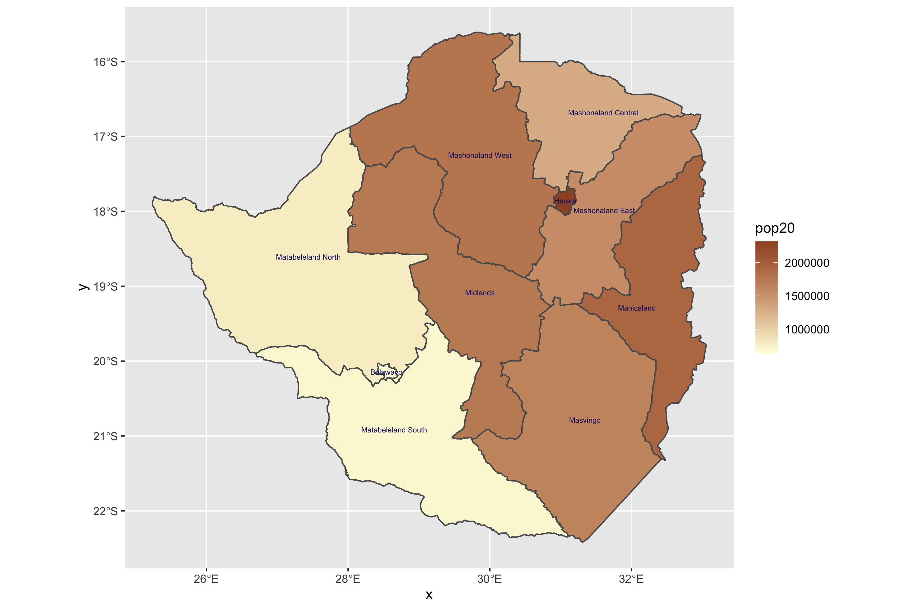

# Project 2 Deliverable 

## Extracting Populations from a Raster and Aggregating to each Unit 
### Challenge Question 

The plot below is created through R studio, showing the population count of Zimbabwe for its adm1 subdivisions in 2020.

