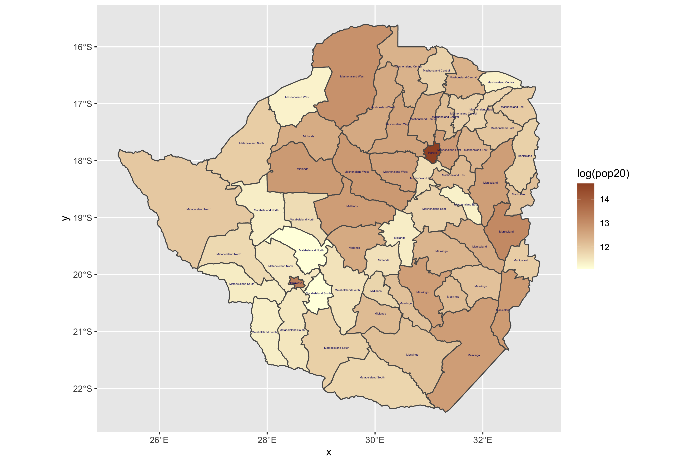
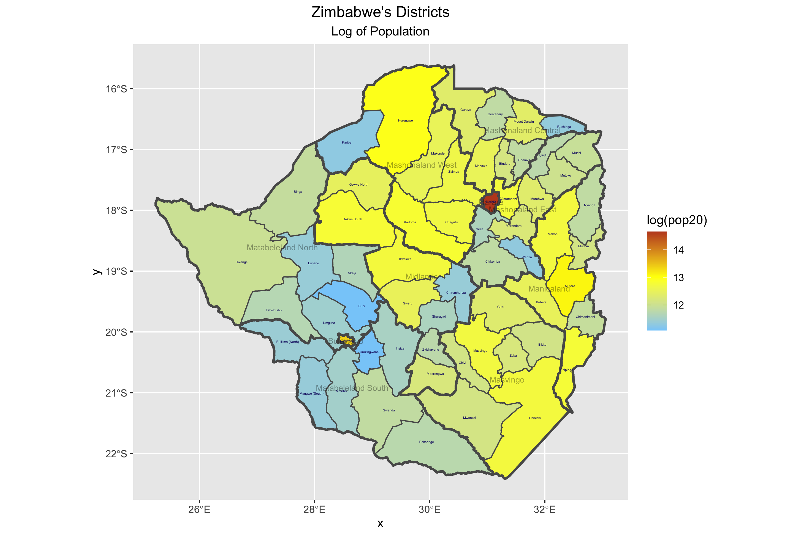

# Project 2 Extra Credits

## Extracting Populations from a Raster and Aggregating to each Unit
### Stretch Goal 1
The plot below is created through R studio, showing the log of population count of Zimbabwe for its adm2 subdivisions in 2020.

### Stretch Goal 2
The plot below is created through R studio, showing the log of population count of Zimbabwe for its subdivisions in 2020 with three color scale.

## Creating a Geometric Bar Plot with your Simple Feature object

### Stretch Goal 3

### Stretch Goal 4

