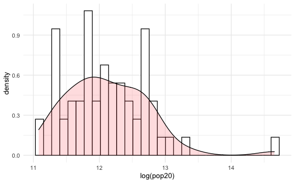
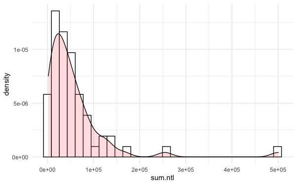
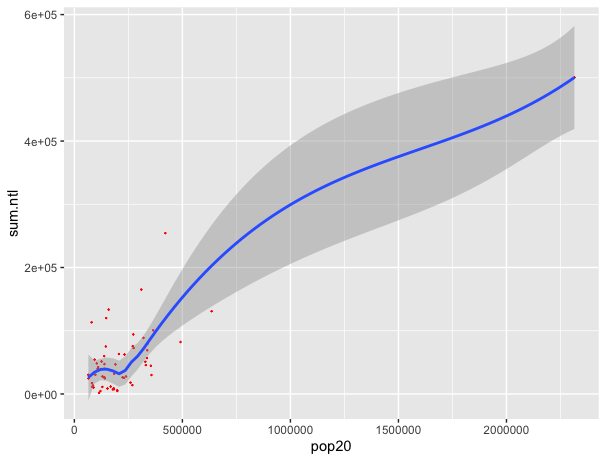
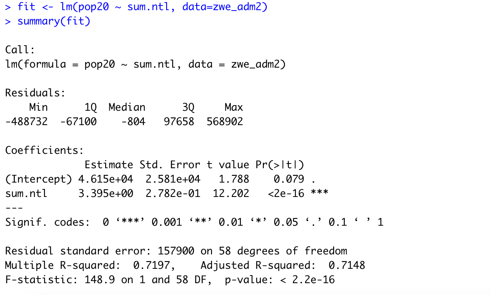
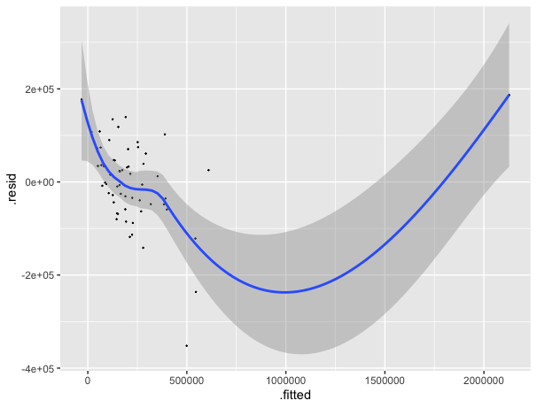
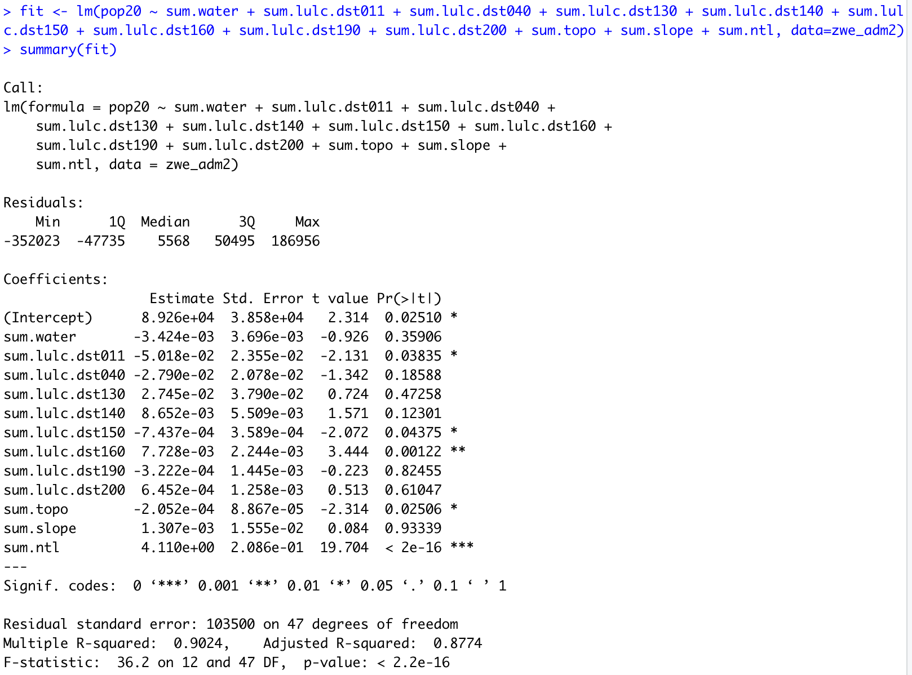

# Project 3 Deliverables
## Acquiring, Modifying, and Describing the Data: Malta
### Challenge Question 1
The plots below are two combined histogram with density plots that describe the correlationship between Zimbabwe's population at the adm2 level as a dependent variable and two of the other variables you (log of population 2020 and sum of ntl respectively).

   
The distribution of the population density in respect of the log of population is approximiatly normal, with a little skewness to right. 
  
The distribution of the population density in respect of the sum of ntl is strongly skew to right.

### Challenge Question 2
The plot below is the linear model showing the correlation between Zimbabwe's population and its geospatial covariaty ntl.  

The screenshot below is this model's description using the fit() and summary() commands. Since we can see the R squared value is 0.7197, there's a moderately strong relationship between the two variables. 

The plot below is the linear model showing the correlation between Zimbabwe's population and a sum of all the land use and land cover geospatial covariaties.  

The screenshot below is this model's description using the fit() and summary() commands. Since we can see the R squared value is 0.9024, there's a extremely strong relationship between the two variables. 

