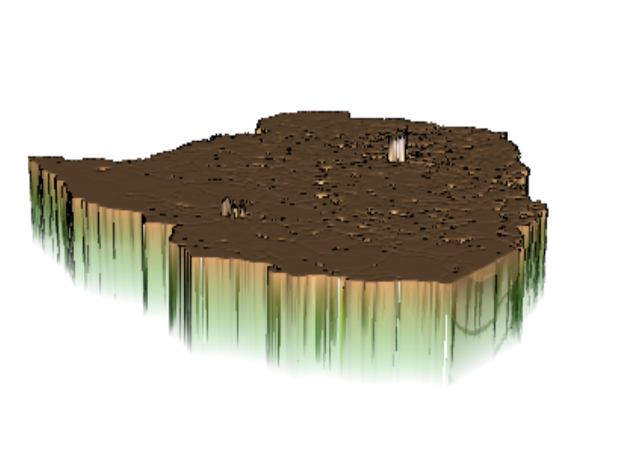

### Here're three sets of spatial plots that describe the predicted population of Zimbabwe using each of the three models.
#### 1. Response variable is population and the predictors are sum of covariates

     a. A plot that describes the predicted population of Zimbabwe using the model

    b. A plot that describes the difference between your predicted results and the WorldPop estimates for 2015

    c. A three dimension plot that visualizes the population or difference

#### 2. Response variable is population and the predictors are mean of covariates
     a. A plot that describes the predicted population of Zimbabwe using the model

    b. A plot that describes the difference between your predicted results and the WorldPop estimates for 2015

    c. A three dimension plot that visualizes the population or difference

#### 3. Reponse variable is log of population and the predictors are mean of covariates
     a. A plot that describes the predicted population of Zimbabwe using the model

    b. A plot that describes the difference between your predicted results and the WorldPop estimates for 2015

    c. A three dimension plot that visualizes the population or difference

