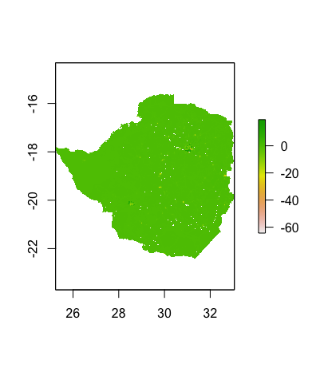
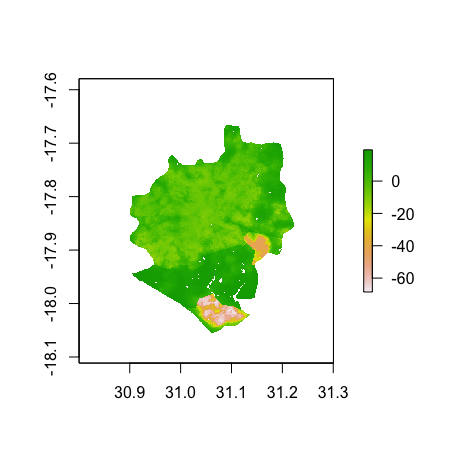
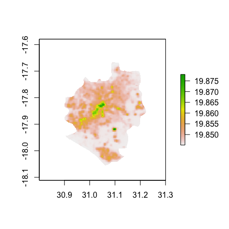
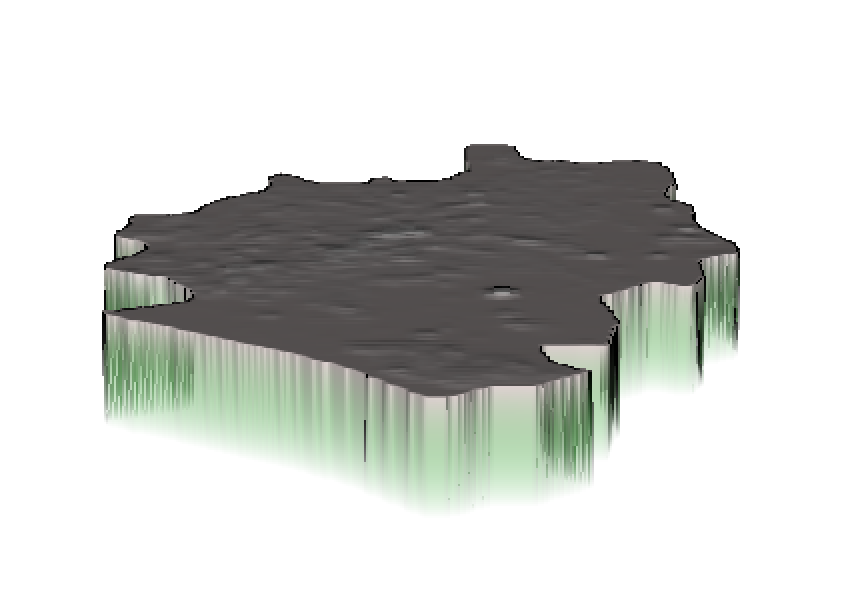

# Project 3 Extra Credits
## Investigate Margins of Error

This graph shows the magnitude and direction of error in my predicted values for Zimbabwe. 
 
 
 
The error is distributed fairly evenly across the entire space except for the northest, which is the city Harare. Therefore I further investigate the difference of predicted value for Harare. 

 
 
 
 Also, there's a three dimension map of the values to gauge exactly how much variation was exhibited in the predicted values.
  
