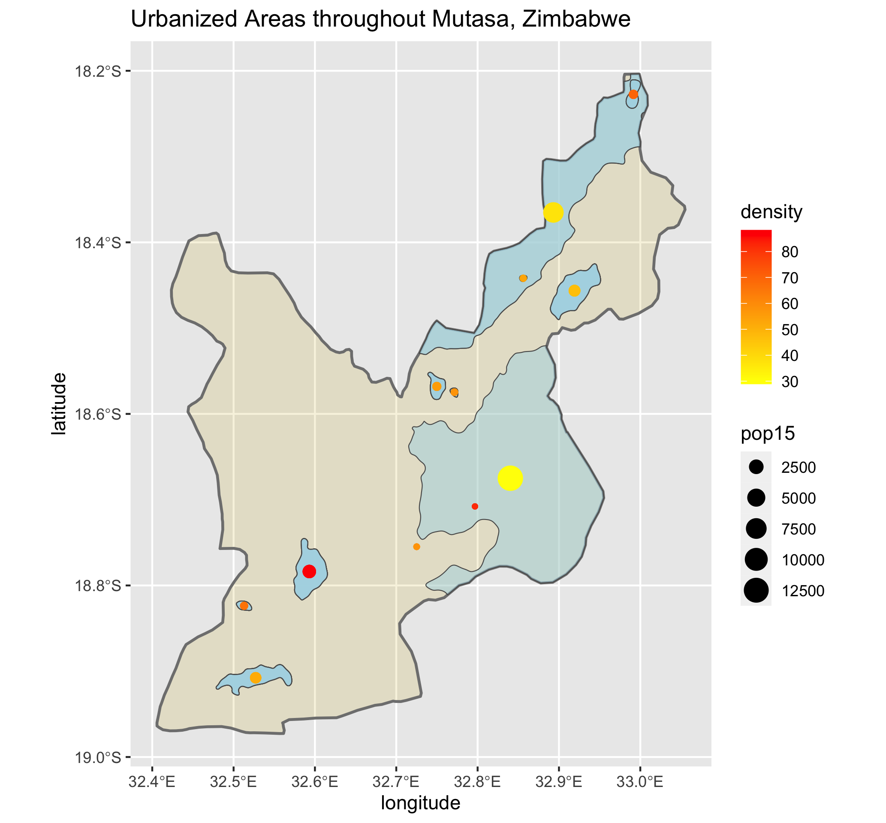
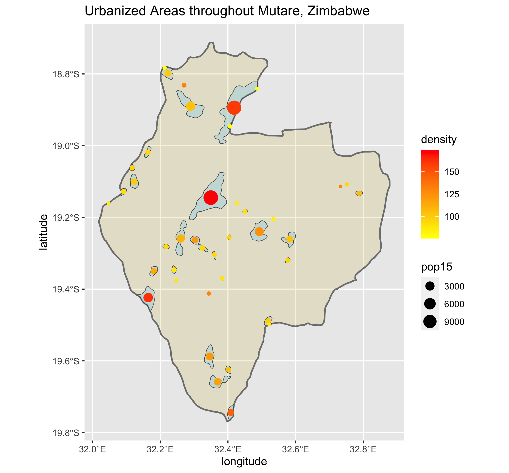
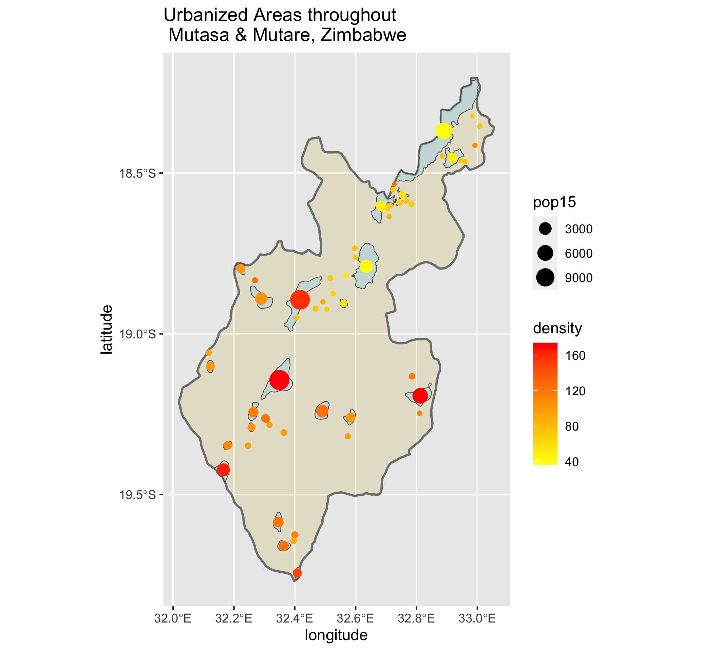

# Accessibilty 1
## De facto description of human settlements and urban areas 
The following plots describe the de facto boundaries of human settlements and urbanization throughout Mutasa and Mutare, Zimbabwe, and the combination of these two adm2. 

   
   

