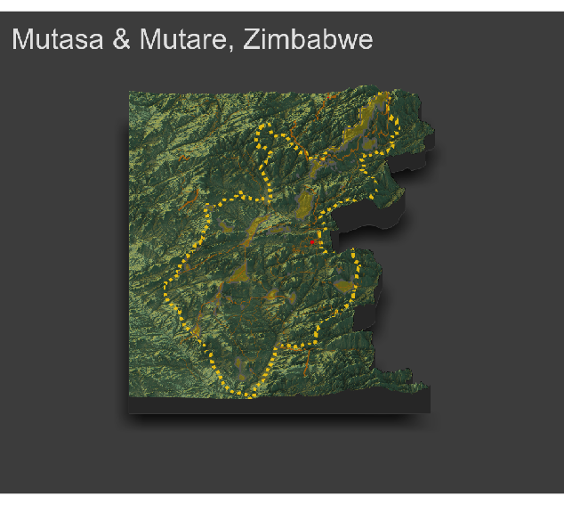

# Accessibility 3
## Rendering Topography

The following plot is a three-dimensional, topographic plot that describes the de facto boundaries of urban areas, the center lines of classified roadways and the location of health care facilities by type throughout Mutasa and Mutare, Zimbabwe. 

From the graph, we can see that most of the urban areas and the only hospital in these two cities are all concentrated in plat terrain. The roadways are established in a way that can help people pass through the montains and valleys and  arrive another urban areas. 

